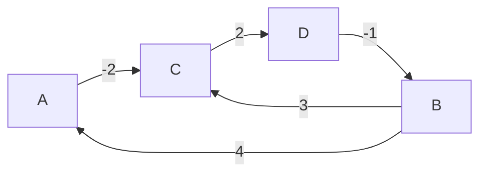

### The Edit Distance Problem

:::important Recurrence Relation
Using optimal subproblems, the recurrence relationship can be defined as:

$$
Dist[i, j] = \begin{cases} 
i,  & \text{if } j=0 \\ 
j, & \text{if } i = 0 \\ 
\min \begin{cases} 
Dist[i-1, j-1]+1_{S_1[i] \neq S_2[j]} \\ 
Dist[i-1, j]+1 \\ 
Dist[i, j-1]+1
\end{cases} & \text{otherwise} 
\end{cases}
$$

**Where:**
- **Substitution:** $Dist[i-1, j-1] + 1$ if characters differ
- **Deletion:** $Dist[i-1, j] + 1$
- **Insertion:** $Dist[i, j-1] + 1$
:::

```python
def edit_distance(s1, s2):
    """
    Calculates the edit distance between two strings using a bottom-up
    dynamic programming approach.

    Args:
        s1: The first string.
        s2: The second string.

    Returns:
        The minimum number of edits (insertions, deletions, or substitutions)
        required to change s1 into s2.
    """
    n = len(s1)
    m = len(s2)

    # Create a DP table (matrix) to store the distances.
    # The table size is (n+1) x (m+1).
    dist = [[0] * (m + 1) for _ in range(n + 1)]

    # Initialize the first row and column of the table.
    # This corresponds to the cost of converting a string to an empty string,
    # which is simply the length of the string (all deletions or insertions).
    for i in range(n + 1):
        dist[i][0] = i
    for j in range(m + 1):
        dist[0][j] = j

    # Fill the rest of the DP table.
    for i in range(1, n + 1):
        for j in range(1, m + 1):
            # If the characters are the same, no operation is needed.
            # The cost is the same as the cost for the smaller substrings.
            # Note: We use i-1 and j-1 because strings are 0-indexed.
            if s1[i - 1] == s2[j - 1]:
                dist[i][j] = dist[i - 1][j - 1]
            else:
                # If characters are different, consider all three operations
                # and find the one with the minimum cost.
                substitution_cost = dist[i - 1][j - 1]
                deletion_cost = dist[i - 1][j]  # Deletion from s1
                insertion_cost = dist[i][j - 1]  # Insertion into s1

                dist[i][j] = min(substitution_cost, deletion_cost, insertion_cost) + 1

    # The final edit distance is in the bottom-right cell of the table.
    return dist[n][m]
```

### Graph Algorithms

#### Bellman-Ford

:::important Algorithm Purpose
To solve for shortest path problems with **negative weights**.
:::

:::tip Key Ideas
- Given a source $s$, the Bellman-Ford algorithm returns the shortest distance from $s$ to all vertices in the graph if there are ==no negative cycles== reachable from $s$
- Cycles with **positive weight** cannot be part of the shortest path
- Cycles of **weight 0** can be removed to obtain an alternative shortest path that is simple
- Any **simple path** has at most $|V|-1$ edges
:::

```python
def bellman_ford(graph_edges, num_vertices, start_vertex):
    """
    Implements the Bellman-Ford algorithm to find the shortest paths from a
    single source vertex to all other vertices in a weighted, directed graph.

    This algorithm can handle negative edge weights and will detect
    negative-weight cycles.

    Args:
        graph_edges: A list of all edges in the graph. Each edge is a tuple
                     in the format (source_u, destination_v, weight).
        num_vertices: The total number of vertices in the graph (n).
        start_vertex: The integer index of the starting vertex (s).

    Returns:
        A tuple of (distances, predecessors).
        If a negative-weight cycle is detected, it returns (None, None).
    """
    # Initialize dist and pred arrays
    dist = [float("inf")] * num_vertices
    pred = [None] * num_vertices

    # Set distance for the source vertex to 0
    dist[start_vertex] = 0

    # Main loop: Relax all edges |V| - 1 times
    # A simple shortest path can have at most |V| - 1 edges.
    for _ in range(num_vertices - 1):
        # For each edge in the graph, perform the relaxation step
        for u, v, weight in graph_edges:
            # The check 'dist[u] != math.inf' ensures that we only relax
            # edges from vertices that are already reachable from the source.
            if dist[u] != math.inf and dist[u] + weight < dist[v]:
                dist[v] = dist[u] + weight
                pred[v] = u

    # Final check for negative-weight cycles.
    # If we can still relax an edge, then a negative cycle exists.
    for u, v, weight in graph_edges:
        if dist[u] != math.inf and dist[u] + weight < dist[v]:
            print("Graph contains a negative-weight cycle!")
            return None, None

    # If no negative cycle is found, return the result
    return dist, pred
```

:::tip Complexity Analysis
**Different approaches for all-pairs shortest paths:**

- **Unweighted graphs:** BFS from every source → $O(|V|(|V| + |E|))$
- **Non-negative weights:** Dijkstra from every source → $O(|V||E|\log|V|)$
- **Negative weights:** Bellman-Ford from every source → $O(|V|^2|E|)$
:::

#### Floyd-Warshall

:::note Triangle Inequality
$\text{Distance}(A \to B) + \text{Distance}(B \to C) = \text{Distance}(A \to C)$
:::



**Construct a matrix for the graph above:**

|  | A | B | C | D |
| --- | --- | --- | --- | --- |
| A | 0 | -1 | -2 | 0 |
| B | 4 | 0 | 2 | 4 |
| C | 5 | 1 | 0 | 2 |
| D | 3 | -1 | 2 | 0 |

```python
def floyd_warshall(graph_edges, num_vertices):
    """
    Implements the Floyd-Warshall algorithm to find all-pairs shortest paths.

    Args:
        graph_edges: A list of all edges in the graph. Each edge is a tuple
                     in the format (source_u, destination_v, weight).
        num_vertices: The total number of vertices in the graph (n).

    Returns:
        A 2D list (matrix) where dist[u][v] is the shortest distance from
        vertex u to vertex v. Returns None if a negative-weight cycle is detected.
    """
    # Initialize the distance matrix
    # dist[u][v] will be the shortest distance from vertex u to v.
    dist = [[float("inf")] * num_vertices for _ in range(num_vertices)]

    # Set distance from a vertex to itself to 0
    for i in range(num_vertices):
        dist[i][i] = 0

    # For all direct edges given in the input, set the initial distances
    for u, v, weight in graph_edges:
        dist[u][v] = weight

    # Main algorithm: consider each vertex k as an intermediate vertex
    for k in range(num_vertices):
        for u in range(num_vertices):
            for v in range(num_vertices):
                # If the path from u to v through k is shorter, update it.
                # dist[u][k] + dist[k][v] is the distance of the path u -> k -> v
                if dist[u][k] != math.inf and dist[k][v] != math.inf:
                    dist[u][v] = min(dist[u][v], dist[u][k] + dist[k][v])

    # Check for negative-weight cycles.
    # If the distance from any vertex to itself becomes negative,
    # it means the vertex is part of a negative cycle.
    for i in range(num_vertices):
        if dist[i][i] < 0:
            print("Graph contains a negative-weight cycle!")
            return None

    return dist
```

#### Summary for All-pairs Shortest Path Algorithms

|  | Sparse | Dense |
| --- | --- | --- |
| Repeated BFS | $O(\|V\|^2)$ | $O(\|V\|^3)$ |
| Repeated Dijkstra | $O(\|V\|^2 log(\|V\|))$ | $O(\|V\|^3 log(\|V\|))$ |
| Repeated Bellman-Ford | $O(\|V\|^3)$ | $O(\|V\|^4)$ |
| Johnson | $O(\|V\|^2 log(\|V\|))$ | $O(\|V\|^3 log(\|V\|))$ |
| Floyd-Warshall | $O(\|V\|^3)$ | $O(\|V\|^3)$ |

#### Transitive Closure

:::info Definition
The **transitive closure** of a graph $G$ is a new graph $G'$ on the same vertices such that there is an edge $(u, v)$ in $G'$ if and only if there is a ==path== between $u$ and $v$ in $G$.
:::

:::note Complexity Optimization
- **Space complexity:** $O(|V|^2 / w)$, where $w$ is the number of bits in a machine word
- **Time complexity:** Can be improved to $O(|V|^3 / w)$ by using bitwise operations
:::

```python
def warshall_transitive_closure(graph_edges, num_vertices):
    """
    Implements Warshall's algorithm to compute the transitive closure of a graph.

    Args:
        graph_edges: A list of all edges in the graph. Each edge is a tuple
                     in the format (source_u, destination_v).
        num_vertices: The total number of vertices in the graph (n).

    Returns:
        A 2D list (boolean matrix) where connected[u][v] is True if there is
        a path from vertex u to vertex v, and False otherwise.
    """
    # Initialize the connectivity matrix.
    # connected[u][v] is True if a path from u to v is known.
    connected = [[False] * num_vertices for _ in range(num_vertices)]

    # Set connectivity from a vertex to itself to True.
    # Every vertex is reachable from itself via a path of length 0.
    for i in range(num_vertices):
        connected[i][i] = True

    # For all direct edges given in the input, set connectivity to True.
    for u, v in graph_edges:
        connected[u][v] = True

    # Main algorithm: consider each vertex k as a potential intermediate vertex
    # in a path from u to v.
    for k in range(num_vertices):
        for u in range(num_vertices):
            for v in range(num_vertices):
                # A path exists from u to v if:
                # 1. A path was already known (connected[u][v] is True), OR
                # 2. A path exists from u to k AND from k to v.
                connected[u][v] = connected[u][v] or \
                                  (connected[u][k] and connected[k][v])

    return connected
```

#### The Critical Path Problem

:::important Problem Definition
The **critical path problem** is the problem of finding the ==longest path== in a **directed acyclic graph** (DAG).
:::

```python
def longest_path_bottom_up(graph, num_vertices, start_node=0):
    """
    Implements Algorithm 57: Bottom-up longest path in a DAG.

    Calculates the length of the longest path starting from each vertex.

    Args:
        graph: The graph represented as an adjacency list dictionary.
               Example: {0: [(1, 5), (2, 3)], ...}
        num_vertices: The total number of vertices in the graph.

    Returns:
        A list where longest[i] is the length of the longest path from vertex i.
    """
    # Get the vertices in topological order, then reverse it.
    topo_order = topological_sort(graph, num_vertices)
    
    # Initialize longest path distances for all vertices to 0.
    longest = [0] * num_vertices

    # Process vertices in reverse topological order
    for u in reversed(topo_order):
        # For each neighbor v of the current vertex u...
        for v, weight in graph.get(u, []):
            # Update the longest path from u if the path through v is longer.
            # longest[v] is already finalized because of the reverse topological order.
            if longest[u] < weight + longest[v]:
                longest[u] = weight + longest[v]
                
    return longest
 
 def topological_sort(graph, num_vertices):
    """Performs a topological sort on a DAG."""
    visited = [False] * num_vertices
    stack = []
    for i in range(num_vertices):
        if not visited[i]:
            topological_sort_util(i, graph, visited, stack)
    return stack[::-1] # Return the reversed stack for topological order
```

```python
def _longest_path_recursive_util(u, graph, longest):
    """
    Recursive utility that implements the logic of Algorithm 58.
    """
    # If the longest path from u is already computed, return the stored value
    if longest[u] is not None:
        return longest[u]

    # Base case: for a sink node, the longest path is 0.
    # We initialize the path length for the current node u to 0.
    max_path = 0

    # For each neighbor v of the current vertex u...
    for v, weight in graph.get(u, []):
        # Recursively find the longest path from v and update the path from u.
        path_from_v = _longest_path_recursive_util(v, graph, longest)
        if max_path < weight + path_from_v:
            max_path = weight + path_from_v
    
    # Memoize (store) the result before returning
    longest[u] = max_path
    return longest[u]

def longest_path_recursive(graph, num_vertices):
    """
    Wrapper function for Algorithm 58: Recursive longest path in a DAG.

    Args:
        graph: The graph represented as an adjacency list dictionary.
        num_vertices: The total number of vertices in the graph.

    Returns:
        A list where longest[i] is the length of the longest path from vertex i.
    """
    # `longest` array contains memoised subproblems.
    # Initialize with None to indicate that they haven't been computed yet.
    longest = [None] * num_vertices

    # Calculate the longest path for each vertex if it hasn't been computed.
    for i in range(num_vertices):
        if longest[i] is None:
            _longest_path_recursive_util(i, graph, longest)

    return longest

def topological_sort_util(u, graph, visited, stack):
    """A recursive utility function for topological sorting."""
    visited[u] = True
    for v, weight in graph.get(u, []):
        if not visited[v]:
            topological_sort_util(v, graph, visited, stack)
    stack.append(u)
```