## The Problem-Solving Agent

An intelligent agent solves problems by moving from an initial state to a desired goal state. This process is formalized into a structured sequence.

:::: steps
1.  **Formulate Goal** ::iconify mdi:flag-checkered::
    The agent first defines what it wants to achieve—the goal state.

2.  **Formulate Problem** ::iconify mdi:puzzle-edit::
    Next, it formalizes the problem, defining states and the actions that transition between them.

3.  **Search** ::iconify mdi:magnify::
    The agent explores sequences of actions to find a path (a **solution**) from the initial state to the goal.

4.  **Execute** ::iconify mdi:play-box::
    Finally, it carries out the actions in the found solution.
::::

## Formal Problem Definition

A problem is formally defined with the following components:

:::: field-group
::: field name="States" type="World configurations" required
The set of all possible configurations, including the **initial state** and one or more **goal states**.
:::
::: field name="Actions" type="Operators" required
The set of actions available in a given state, denoted as `ACTIONS(s)`.
:::
::: field name="Transition Model" type="`RESULTS(s, a)`" required
A function describing the state that results from performing action `a` in state `s`.
:::
::: field name="Action Cost" type="`c(s, a, s')`" optional
The cost of performing action `a` to go from state `s` to `s'`.
:::
::: field name="Goal Test" type="Constraint" required
A function to determine if a given state is a goal state.
:::
::::

::: details Example: Romania Travel
*   **States**: Cities on the map.
*   **Initial State**: `In(Arad)`
*   **Goal Test**: `Is In(Bucharest)?`
*   **Actions**: `Go(city)`, e.g., `Go(Sibiu)`.
*   **Transition Model**: `RESULT(In(Arad), Go(Sibiu))` -> `In(Sibiu)`.
*   **Path Cost**: Sum of distances between cities.
:::

## Tree Search vs. Graph Search

The core difference between tree and graph search lies in how they handle repeated states.

::: tabs

@tab Tree Search

Tree search explores the state space without remembering past states. It builds a search tree, adding successors of expanded nodes to a **frontier**.

*   **Major Flaw**: It can get stuck in ==infinite loops=={.danger} in state spaces with cycles and may explore redundant, suboptimal paths.

```python
import collections

# A Node class is used to build the search tree
class Node:
    """A node in a search tree. Contains a pointer to the parent and the state,
    the action that led to this state, and the total path cost."""
    def __init__(self, state, parent=None, action=None, path_cost=0):
        self.state = state
        self.parent = parent
        self.action = action
        self.path_cost = path_cost

def tree_search(problem, frontier):
    """
    A generic implementation of the Tree Search algorithm.
    It does NOT include an 'explored' set.
    """
    frontier.append(Node(problem.initial))

    while frontier:
        node = frontier.popleft() # Using popleft for FIFO behavior (BFS)

        if problem.is_goal(node.state):
            return node # Return the goal node to reconstruct the path

        for action in problem.get_actions(node.state):
            child_state = problem.get_result(node.state, action)
            child_node = Node(
                state=child_state,
                parent=node,
                action=action
            )
            frontier.append(child_node)

    return None # Return None if no solution is found
```

@tab Graph Search

Graph search improves on tree search by keeping track of visited states in an **explored set**.

*   **Key Improvement**: When expanding a node, if a successor is in the explored set or frontier, it is ignored or updated. This ==prevents infinite loops and redundant paths=={.success}, making it much more efficient.

```python
import collections

class Node:
    """A node in a search tree. Contains a pointer to the parent and the state.
    Also includes the action that led to this state and the total path cost."""
    def __init__(self, state, parent=None, action=None, path_cost=0):
        self.state = state
        self.parent = parent
        self.action = action
        self.path_cost = path_cost

    def __repr__(self):
        return f"<Node {self.state}>"

    def __eq__(self, other):
        return isinstance(other, Node) and self.state == other.state

    def __hash__(self):
        return hash(self.state)

def graph_search(problem, frontier):
    """
    Searches for a solution using the Graph Search algorithm.
    """
    frontier.append(Node(problem.initial_state))
    explored = set()

    while frontier:
        node = frontier.popleft() # For BFS, pop from the left (FIFO)

        if problem.is_goal(node.state):
            solution_path = []
            while node.parent is not None:
                solution_path.append(node.action)
                node = node.parent
            return solution_path[::-1]

        explored.add(node.state)

        for action in problem.get_actions(node.state):
            child_state = problem.get_result(node.state, action)
            child_node = Node(child_state, node, action, node.path_cost + 1)

            if child_state not in explored and child_node not in frontier:
                frontier.append(child_node)

    return None
```
:::


## Uninformed Search Strategies

Uninformed search strategies explore the state space without any knowledge of how close a state is to the goal.

:::: card-grid
::: card title="Breadth-First Search (BFS)" icon="mdi:arrow-expand-horizontal"
Expands the ==shallowest unexpanded node=={.tip} first using a **FIFO queue**.
*   **Complete?** Yes.
*   **Optimal?** Yes, if costs are identical.
*   **Complexity**: Time/Space $O(b^d)$.
:::
::: card title="Uniform-Cost Search (UCS)" icon="mdi:cash-multiple"
Expands the node with the ==lowest path cost (`g(n)`)=={.tip} using a **priority queue**.
*   **Complete?** Yes (if costs > 0).
*   **Optimal?** Yes.
*   **Complexity**: Time/Space $O(b^{1+floor(C^*/\epsilon)})$.
:::
::: card title="Depth-First Search (DFS)" icon="mdi:arrow-expand-down"
Expands the ==deepest unexpanded node=={.tip} first using a **LIFO stack**.
*   **Complete?** No.
*   **Optimal?** No.
*   **Complexity**: Time $O(b^m)$, Space $O(bm)$.
:::
::: card title="Depth-Limited Search (DLS)" icon="mdi:ruler-square"
A DFS with a depth limit `L`. ==Solves the infinite loop problem=={.success} but is incomplete if the solution is deeper than `L`.
:::
::: card title="Iterative Deepening Search (IDS)" icon="mdi:cached"
Combines BFS and DFS benefits by running DLS with increasing depth limits.
*   **Complete?** Yes.
*   **Optimal?** Yes, if costs are identical.
*   **Complexity**: Time $O(b^d)$, Space $O(bd)$.
:::
::::

### Summary of Strategies

| Criterion | Breadth-First | Uniform-Cost | Depth-First | Depth-Limited | Iterative Deepening |
| :---: | :---: | :---: | :---: | :---: | :---: |
| **Complete?** | Yes | Yes | No | No | Yes |
| **Optimal?** | Yes (costs equal) | Yes | No | No | Yes (costs equal) |
| **Time** | $O(b^d)$ | $O(b^{1+\lfloor C^*/\epsilon \rfloor})$ | $O(b^m)$ | $O(b^L)$ | $O(b^d)$ |
| **Space** | $O(b^d)$ | $O(b^{1+\lfloor C^*/\epsilon \rfloor})$ | $O(bm)$ | $O(bL)$ | $O(bd)$ |

*   `b`: branching factor
*   `d`: depth of shallowest solution
*   `m`: max depth
*   `L`: depth limit
*   `C*`: optimal cost

## Algorithm Flow

This diagram illustrates how the components interact in graph search.

```mermaid
flowchart TD
    subgraph PD["🎯 Problem Definition"]
        A["📍 Initial State"]
        B["⚡ Actions"]
        C["🔄 Transition Model"]
        D["🏆 Goal Test"]
    end

    subgraph SA["🔍 Search Algorithm"]
        GS["🧠 graph_search()"]
        F["📋 Frontier<br/>(FIFO Queue for BFS)"]
        N["🔗 Node Class"]
        E["✅ Explored Set"]
    end

    subgraph R["📊 Result"]
        SP["🛤️ Solution Path"]
    end

    PD --> GS
    GS <--> F
    GS --> N
    GS --> E
    F --> GS
    N --> F
    E --> GS
    GS --> SP

    
    
    class PD,A,B,C,D problem
    class SA,GS,F,N,E algorithm
    class R,SP result
```


## Uniform-Cost Search

Uniform-Cost Search (UCS) is an uninformed search algorithm that finds the least-cost path from a start to a goal state. Unlike Breadth-First Search, which expands the shallowest node, UCS expands the node with the lowest **path cost** (`g(n)`). This is achieved by using a priority queue for the frontier.

### Uniform-Cost Search (UCS) Implementation

This Python function implements the UCS algorithm. It uses a **priority queue** (implemented with Python's `heapq` module) for the frontier to ensure the node with the lowest path cost is always selected for expansion. It also uses an `explored` dictionary to store the lowest cost found so far to reach each state, allowing it to update paths if a cheaper one is discovered.

```python
import heapq

def uniform_cost_search(problem):
    """
    Implements Uniform-Cost Search using a priority queue for the frontier.
    Finds the path with the minimum total cost.
    """
    # The start node has a path cost of 0.
    node = Node(problem.initial, path_cost=0)

    # The frontier is a priority queue, ordered by path cost.
    # We store tuples of (cost, node) to allow the heap to sort correctly.
    frontier = [(node.path_cost, node)]
    
    # The explored set is a dictionary mapping a state to its lowest found path cost.
    explored = {problem.initial: 0}

    while frontier:
        # Pop the node with the lowest cost from the priority queue.
        cost, node = heapq.heappop(frontier)

        # If the goal is reached, reconstruct and return the solution.
        if problem.is_goal(node.state):
            solution_path = []
            while node.parent is not None:
                solution_path.append(node.state)
                node = node.parent
            solution_path.append(node.state)
            return solution_path[::-1], cost

        # Expand the node.
        for action in problem.get_actions(node.state):
            child_state = problem.get_result(node.state, action)
            
            # Calculate the new path cost to reach the child.
            new_cost = cost + problem.action_cost(node.state, action, child_state)

            # If the child hasn't been explored, or we've found a cheaper path to it,
            # add it to the frontier and update the explored set.
            if child_state not in explored or new_cost < explored[child_state]:
                explored[child_state] = new_cost
                child_node = Node(child_state, node, action, new_cost)
                heapq.heappush(frontier, (new_cost, child_node))
                
    return None, 0 # Return None if no solution is found
```

### Required `Node` Class Modification

For Python's `heapq` to function as a priority queue with custom objects like our `Node`, the class needs a method to compare two objects. We add the `__lt__` (less than) method, which compares nodes based on their `path_cost`.

```python
class Node:
    """A node in a search tree, modified for use in a priority queue."""
    def __init__(self, state, parent=None, action=None, path_cost=0):
        self.state = state
        self.parent = parent
        self.action = action
        self.path_cost = path_cost

    def __repr__(self):
        return f"<Node {self.state}>"

    # Add a less-than method for the priority queue (heapq)
    def __lt__(self, other):
        return self.path_cost < other.path_cost
```

### Implementation Diagram

This graph shows the components of the UCS implementation. It highlights the use of a **Priority Queue** for the frontier, which is ordered by **Path Cost**, and an **Explored Set** that also stores costs to handle path updates.

