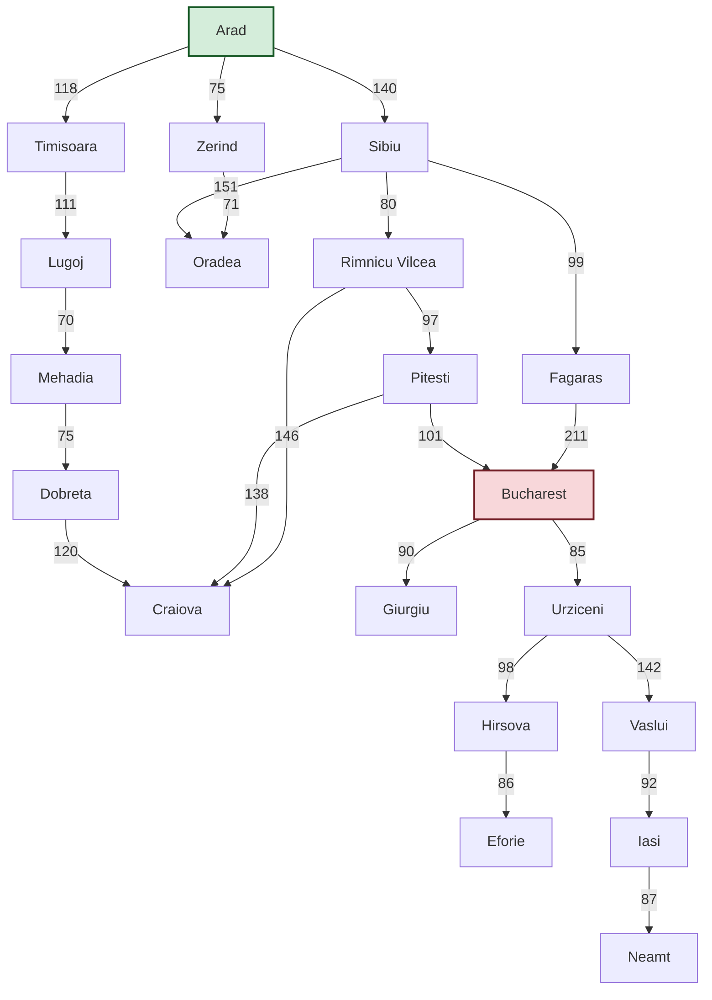

This implementation defines the Romania map as a formal problem and then uses Breadth-First Search (BFS), Depth-First Search (DFS), and Uniform-Cost Search (UCS) to find a path from Arad to Bucharest, from a problem from FIT3080 (a Monash University Unit).

-----

### Romania Problem Definition

First, we define the `RomaniaProblem`. This class encapsulates the map data and the rules of the problem, such as the initial state, goal state, available actions from each city, and the cost of traveling between them.

```python
class RomaniaProblem:
    """
    This class defines the Romania travel problem, encapsulating the map,
    initial state, and goal state.
    """
    def __init__(self, initial, goal='Bucharest'):
        self.initial = initial
        self.goal = goal
        self.map = {
            'Arad': {'Zerind': 75, 'Sibiu': 140, 'Timisoara': 118},
            'Zerind': {'Arad': 75, 'Oradea': 71},
            'Oradea': {'Zerind': 71, 'Sibiu': 151},
            'Sibiu': {'Arad': 140, 'Oradea': 151, 'Fagaras': 99, 'Rimnicu Vilcea': 80},
            'Timisoara': {'Arad': 118, 'Lugoj': 111},
            'Lugoj': {'Timisoara': 111, 'Mehadia': 70},
            'Mehadia': {'Lugoj': 70, 'Dobreta': 75},
            'Dobreta': {'Mehadia': 75, 'Craiova': 120},
            'Craiova': {'Dobreta': 120, 'Rimnicu Vilcea': 146, 'Pitesti': 138},
            'Rimnicu Vilcea': {'Sibiu': 80, 'Craiova': 146, 'Pitesti': 97},
            'Fagaras': {'Sibiu': 99, 'Bucharest': 211},
            'Pitesti': {'Rimnicu Vilcea': 97, 'Craiova': 138, 'Bucharest': 101},
            'Bucharest': {'Fagaras': 211, 'Pitesti': 101, 'Giurgiu': 90, 'Urziceni': 85},
            'Giurgiu': {'Bucharest': 90},
            'Urziceni': {'Bucharest': 85, 'Hirsova': 98, 'Vaslui': 142},
            'Hirsova': {'Urziceni': 98, 'Eforie': 86},
            'Eforie': {'Hirsova': 86},
            'Vaslui': {'Urziceni': 142, 'Iasi': 92},
            'Iasi': {'Vaslui': 92, 'Neamt': 87},
            'Neamt': {'Iasi': 87}
        }

    def get_actions(self, state):
        """Returns a list of cities reachable from the given city (state)."""
        return list(self.map[state].keys())

    def get_result(self, state, action):
        """The transition model. Returns the state (city) that results from
        taking the given action."""
        return action

    def is_goal(self, state):
        """Returns True if the state is the goal."""
        return state == self.goal

    def action_cost(self, state1, action, state2):
        """Returns the cost of an action. In this problem, it's the
        distance between the two cities."""
        return self.map[state1][state2]
```

-----

### Map Visualization

This graph visualizes the connections and distances between the cities in Romania as defined in the code.



-----

### Search Algorithms & Main Execution

Here is the implementation of the search algorithms and the main script to run them. We reuse the `Node` class and provide implementations for BFS, DFS, and UCS. The main block then calls each search and prints its result.

```python
import collections
import heapq

class Node:
    """A node in a search tree."""
    def __init__(self, state, parent=None, action=None, path_cost=0):
        self.state = state
        self.parent = parent
        self.action = action
        self.path_cost = path_cost

    def __lt__(self, other):
        # Comparison for priority queue
        return self.path_cost < other.path_cost

def get_solution(node):
    """Helper function to reconstruct the path from a goal node."""
    path = []
    cost = node.path_cost
    while node.parent:
        path.append(node.state)
        node = node.parent
    path.append(node.state)
    return path[::-1], cost

def breadth_first_search(problem):
    node = Node(problem.initial)
    if problem.is_goal(node.state):
        return get_solution(node)
    frontier = collections.deque([node])
    explored = {problem.initial}
    while frontier:
        node = frontier.popleft()
        for action in problem.get_actions(node.state):
            child_state = problem.get_result(node.state, action)
            if child_state not in explored:
                child_node = Node(child_state, node, action)
                if problem.is_goal(child_node.state):
                    return get_solution(child_node)
                frontier.append(child_node)
                explored.add(child_state)
    return None, 0

def depth_first_search(problem):
    frontier = [Node(problem.initial)] # Stack (LIFO)
    explored = set()
    while frontier:
        node = frontier.pop()
        if problem.is_goal(node.state):
            return get_solution(node)
        explored.add(node.state)
        for action in problem.get_actions(node.state):
            child_state = problem.get_result(node.state, action)
            if child_state not in explored:
                frontier.append(Node(child_state, node, action))
    return None, 0

def uniform_cost_search(problem):
    node = Node(problem.initial, path_cost=0)
    frontier = [(node.path_cost, node)] # Priority Queue (min-heap)
    explored = {problem.initial: 0}
    while frontier:
        cost, node = heapq.heappop(frontier)
        if problem.is_goal(node.state):
            return get_solution(node)
        for action in problem.get_actions(node.state):
            new_cost = cost + problem.action_cost(node.state, action, '')
            child_state = problem.get_result(node.state, action)
            if child_state not in explored or new_cost < explored[child_state]:
                explored[child_state] = new_cost
                child_node = Node(child_state, node, action, new_cost)
                heapq.heappush(frontier, (new_cost, child_node))
    return None, 0

# --- Main Execution Block ---
if __name__ == "__main__":
    problem = RomaniaProblem('Arad', 'Bucharest')

    # Breadth-First Search (finds path with fewest cities)
    print("--- Running Breadth-First Search (BFS) ---")
    path_bfs, cost_bfs = breadth_first_search(problem)
    if path_bfs:
        print(f"  Path: {' -> '.join(path_bfs)}")
        print(f"  Steps: {len(path_bfs) - 1}\n")

    # Depth-First Search (finds a path, not necessarily optimal)
    print("--- Running Depth-First Search (DFS) ---")
    path_dfs, cost_dfs = depth_first_search(problem)
    if path_dfs:
        print(f"  Path: {' -> '.join(path_dfs)}")
        print(f"  Total Distance: {cost_dfs}\n")

    # Uniform-Cost Search (finds path with shortest total distance)
    print("--- Running Uniform-Cost Search (UCS) ---")
    path_ucs, cost_ucs = uniform_cost_search(problem)
    if path_ucs:
        print(f"  Path: {' -> '.join(path_ucs)}")
        print(f"  Total Distance: {cost_ucs}\n")
```

### Results and Comparison

When you run the script, you'll notice that the different search strategies find different paths from Arad to Bucharest:

  * **BFS** finds the path with the fewest cities, which is `Arad -> Sibiu -> Fagaras -> Bucharest`. This path has 3 steps.
  * **DFS** finds a much longer, non-optimal path because it explores one branch as deeply as possible before backtracking.
  * **UCS** is guaranteed to find the path with the shortest total distance, which is `Arad -> Sibiu -> Rimnicu Vilcea -> Pitesti -> Bucharest`, for a total cost of **418 km**. While this path has more steps than the BFS solution, it is the most efficient in terms of distance traveled.