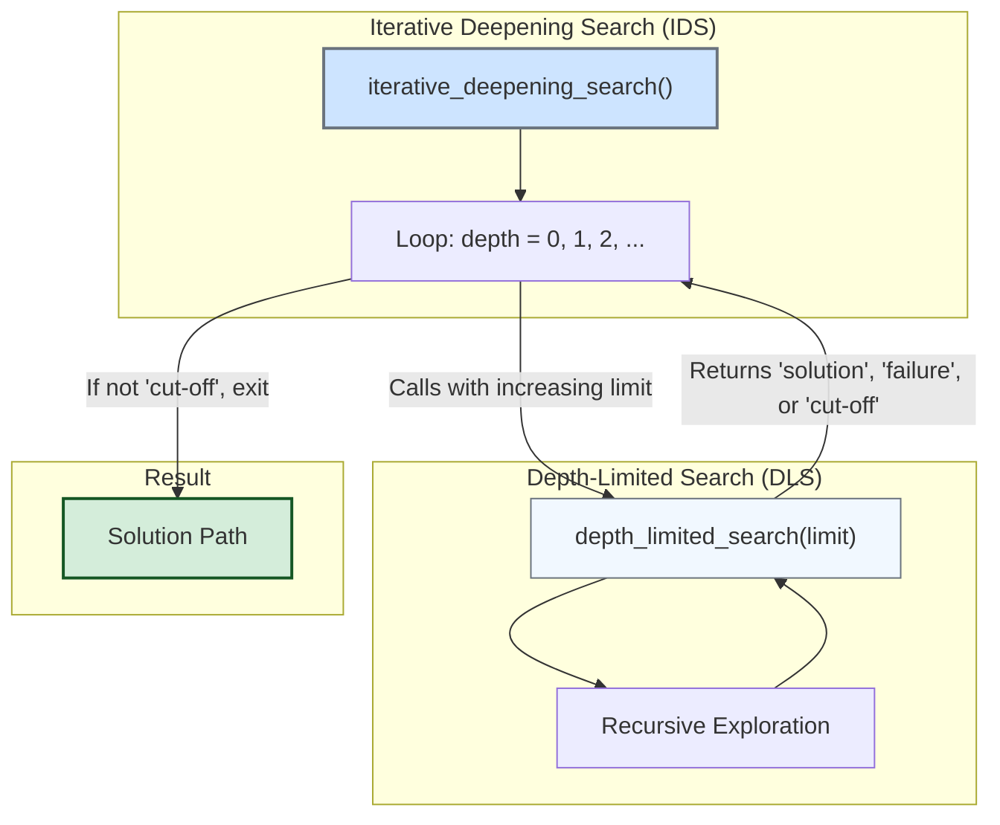

Iterative Deepening Search is a hybrid strategy that combines the low memory footprint of Depth-First Search with the completeness and optimality (for uniform step costs) of Breadth-First Search. It works by performing a series of depth-limited searches with progressively increasing depth limits.

### Core Component: Depth-Limited Search (DLS)

The building block for IDS is Depth-Limited Search. This is a recursive function that performs a depth-first search but stops exploring once it reaches a specified depth `limit`. It needs to return three distinct results: a solution `Node` if found, `None` if no solution exists within the limit, or the special string `'cut-off'` if the search was stopped because the limit was reached.

```python
def depth_limited_search(problem, node, limit):
    """
    A recursive implementation of Depth-Limited Search.
    Returns a solution node, 'cut-off', or None.
    """
    # Check if the current node is the goal
    if problem.is_goal(node.state):
        return node
    
    # If the depth limit is reached, return 'cut-off'
    elif limit == 0:
        return 'cut-off'
    
    else:
        cutoff_occurred = False
        # Expand the node by exploring its children
        for action in problem.get_actions(node.state):
            child_state = problem.get_result(node.state, action)
            child_node = Node(child_state, node, action)

            # Recursive call with a decremented limit
            result = depth_limited_search(problem, child_node, limit - 1)
            
            # Check the result of the recursive call
            if result == 'cut-off':
                cutoff_occurred = True
            elif result is not None:
                return result # Solution found, return it up the call stack
        
        # If a cutoff occurred in any child branch, report it
        return 'cut-off' if cutoff_occurred else None

```

-----

### Iterative Deepening Search (IDS) Implementation

The main IDS function acts as a controller. It repeatedly calls the `depth_limited_search` function in a loop, starting with a depth limit of 0 and increasing it by 1 in each iteration. It continues until DLS returns a valid solution or confirms that no solution exists.

```python
import itertools

def iterative_deepening_search(problem):
    """
    Implements Iterative Deepening Search (IDS) by repeatedly calling
    Depth-Limited Search with an increasing depth limit.
    """
    # Loop through depths from 0 to infinity
    for depth in itertools.count():
        start_node = Node(problem.initial)
        result = depth_limited_search(problem, start_node, depth)
        
        # If DLS did not experience a cut-off, it means the search
        # is complete (either found a solution or failed).
        if result != 'cut-off':
            # Reconstruct path if a solution node was returned
            if result is not None:
                path = []
                node = result
                while node.parent:
                    path.append(node.state)
                    node = node.parent
                path.append(node.state)
                return path[::-1]
            else:
                return None # No solution found

```

-----

### Implementation Diagram

This diagram illustrates the relationship between the IDS controller loop and the DLS worker function. IDS manages the `depth_limit` and calls DLS, which performs the actual recursive search.



-----

### Full Example with Romania Problem

Here is the full script to run IDS on the Romania travel problem. Because IDS finds the shallowest goal node, its solution will have the fewest steps, just like BFS.

::: details Full Runnable Code

```python
import itertools

class Node:
    """A node in a search tree."""
    def __init__(self, state, parent=None, action=None):
        self.state = state
        self.parent = parent
        self.action = action

class RomaniaProblem:
    """Defines the Romania travel problem."""
    def __init__(self, initial, goal='Bucharest'):
        self.initial = initial
        self.goal = goal
        self.map = {
            'Arad': {'Zerind', 'Sibiu', 'Timisoara'},
            'Zerind': {'Arad', 'Oradea'},
            'Oradea': {'Zerind', 'Sibiu'},
            'Sibiu': {'Arad', 'Oradea', 'Fagaras', 'Rimnicu Vilcea'},
            'Timisoara': {'Arad', 'Lugoj'},
            'Lugoj': {'Timisoara', 'Mehadia'},
            'Mehadia': {'Lugoj', 'Dobreta'},
            'Dobreta': {'Mehadia', 'Craiova'},
            'Craiova': {'Dobreta', 'Rimnicu Vilcea', 'Pitesti'},
            'Rimnicu Vilcea': {'Sibiu', 'Craiova', 'Pitesti'},
            'Fagaras': {'Sibiu', 'Bucharest'},
            'Pitesti': {'Rimnicu Vilcea', 'Craiova', 'Bucharest'},
            'Bucharest': {'Fagaras', 'Pitesti', 'Giurgiu', 'Urziceni'},
            'Giurgiu': {'Bucharest'},
            'Urziceni': {'Bucharest', 'Hirsova', 'Vaslui'},
            'Hirsova': {'Urziceni', 'Eforie'},
            'Eforie': {'Hirsova'},
            'Vaslui': {'Urziceni', 'Iasi'},
            'Iasi': {'Vaslui', 'Neamt'},
            'Neamt': {'Iasi'}
        }

    def get_actions(self, state):
        return self.map[state]

    def get_result(self, state, action):
        return action

    def is_goal(self, state):
        return state == self.goal

def depth_limited_search(problem, node, limit):
    if problem.is_goal(node.state):
        return node
    elif limit == 0:
        return 'cut-off'
    else:
        cutoff_occurred = False
        for action in problem.get_actions(node.state):
            child_state = problem.get_result(node.state, action)
            child_node = Node(child_state, node, action)
            result = depth_limited_search(problem, child_node, limit - 1)
            if result == 'cut-off':
                cutoff_occurred = True
            elif result is not None:
                return result
        return 'cut-off' if cutoff_occurred else None

def iterative_deepening_search(problem):
    for depth in itertools.count():
        result = depth_limited_search(problem, Node(problem.initial), depth)
        if result != 'cut-off':
            if result is not None:
                path = []
                node = result
                while node.parent:
                    path.append(node.state)
                    node = node.parent
                path.append(node.state)
                return path[::-1]
            else:
                return None

# --- Main Execution ---
if __name__ == "__main__":
    problem = RomaniaProblem('Arad', 'Bucharest')

    print("--- Running Iterative Deepening Search (IDS) ---")
    path_ids = iterative_deepening_search(problem)

    if path_ids:
        print(f"  Path Found: {' -> '.join(path_ids)}")
        print(f"  Steps: {len(path_ids) - 1}")
    else:
        print("  No solution found.")
```

:::

**Sample Output:**

```
--- Running Iterative Deepening Search (IDS) ---
  Path Found: Arad -> Sibiu -> Fagaras -> Bucharest
  Steps: 3
```

This output shows that IDS found the optimal solution in terms of the number of steps, just like BFS would, but with the memory efficiency of DFS.