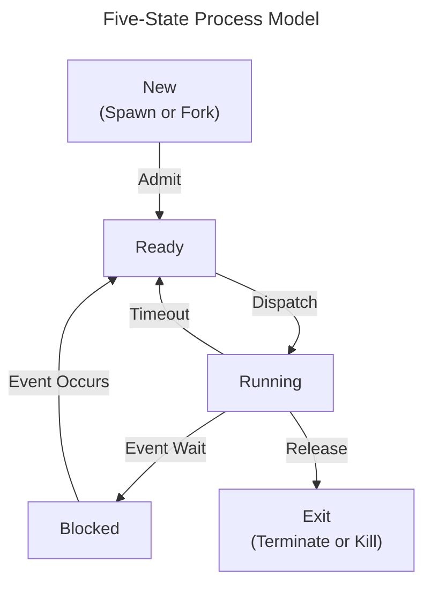

## Processes in Operating Systems

A **process** is a fundamental concept in operating systems. It can be defined in several ways:

  * A program in execution.
  * An instance of a program running on a computer.
  * The entity that can be assigned to and executed on a processor.
  * A unit of activity characterized by the execution of a sequence of instructions, a current state, and an associated set of system instructions.

A process is comprised of:

  * **Program code**, which may be shared with other processes.
  * A **set of data**.
  * A number of **attributes** that describe the state of the process.

## Process Identity and State Information

For an operating system to manage and identify a process, it must maintain specific attributes. The minimum required information includes:

1.  **Identifier**: A unique ID for the process.
2.  **State**: The current state of the process (e.g., running, waiting).
3.  **Priority**: The priority level relative to other processes.
4.  **Program counter**: The address of the next instruction to be executed.
5.  **Memory pointers**: Pointers to the code, data, and other memory segments used by the process.
6.  **Context data**: Data held in processor registers.
7.  **I/O status information**: Includes outstanding I/O requests, open files, etc.
8.  **Accounting information**: CPU time used, time limits, etc.

This collection of information is stored in a data structure called a **Process Control Block (PCB)**.

## Process Control Block (PCB)

The PCB is a critical data structure managed by the operating system.

  * It contains all the essential elements and attributes of a process.
  * The operating system creates and manages a PCB for every process, which allows it to support the execution of multiple processes.
  * The specific structure and format of a PCB are unique to each operating system; they are generally not interchangeable between different OS types.

## Processes in Memory

When user processes are loaded into virtual memory, they each have their own **private user address space**, which contains their programs and data, as well as a **user stack**. Processes can also utilize a **shared address space** to communicate or share resources with other processes. Each process is associated with its own Process Control Block, which holds its identification, processor state, and other control information.

## Process States

A process transitions through various states during its lifecycle. A common model is the **five-state process model**. Inter-Process Communications (IPC) may or may not cause a process to block.

## Unix Process States

Unix and Unix-like systems define a more detailed set of process states:

| State | Description |
| :--- | :--- |
| **User Running** | Executing in user mode. |
| **Kernel Running** | Executing in kernel mode. |
| **Ready to Run, in Memory**| Ready to run as soon as the kernel schedules it. |
| **Asleep in Memory** | Unable to execute until an event occurs; the process is in main memory (a blocked state). |
| **Ready to Run, Swapped** | The process is ready to run, but the swapper must swap it into main memory before the kernel can schedule it to execute. |
| **Sleeping, Swapped** | The process is awaiting an event and has been swapped to secondary storage (a blocked state). |
| **Preempted** | The process is returning from kernel to user mode, but the kernel preempts it and does a process switch to schedule another process. |
| **Created** | The process is newly created and not yet ready to run. |
| **Zombie** | The process no longer exists, but it leaves a record for its parent process to collect. |