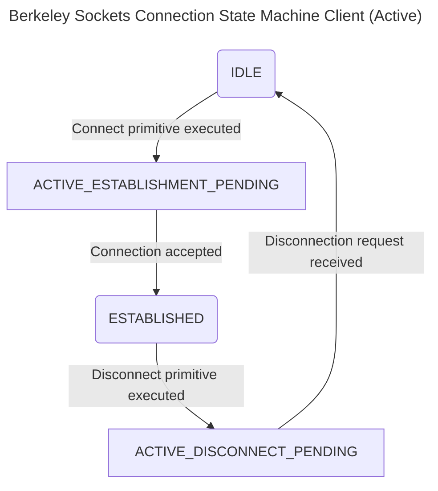
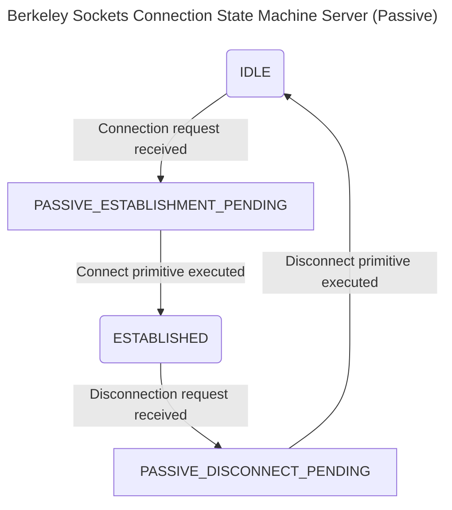

## BSD Socket API Programming in C

The Berkeley (BSD) Socket API is the standard low-level programming interface for network-based Inter-Process Communication (IPC). It is available on nearly all modern operating systems.

The process of establishing and managing a connection follows a defined state machine. The diagram below illustrates the sequence of states for both the client (active connection) and the server (passive connection).





## Socket Primitives

The core of the Socket API is a set of functions, or primitives, used to manage the connection lifecycle.

| Primitive | Meaning |
| :--- | :--- |
| **SOCKET** | Creates a new communication endpoint. |
| **BIND** | Associates a local address and port with a socket. |
| **LISTEN** | Announces willingness to accept connections (server-side). |
| **ACCEPT** | Passively establishes an incoming connection (server-side). |
| **CONNECT** | Actively attempts to establish a connection (client-side). |
| **SEND** | Sends data over the connection. |
| **RECEIVE** | Receives data from the connection. |
| **CLOSE** | Releases the connection. |


## Programming with the Socket API

Socket programming follows a **client-server model**, where a server process must be running and listening before a client can connect to it.

For C programming, the following header files are typically required:

```c
#include <stdio.h>
#include <sys/types.h>
#include <sys/socket.h>
#include <netinet/in.h>
```

### Server-Side Programming Steps

1.  **`socket()`**: Create a new socket endpoint.
2.  **`bind()`**: Assign a specific IP address and port number to the socket so clients know where to find it.
3.  **`listen()`**: Place the socket in a listening state to monitor for incoming connection requests from clients.
4.  **`accept()`**: Accept an incoming connection from a client, which creates a new socket for the actual communication.

### Client-Side Programming Steps

1.  **`socket()`**: Create a new socket endpoint.
2.  **`connect()`**: Use the server's IP address and port number to establish a connection to the listening server socket.
3.  **`write()` / `read()`**: Once the server accepts the connection, use standard system calls to send and receive data.
4.  **`close()`**: Shut down the connection when communication is finished.


## Key Socket Parameters

The `int socket(int domain, int type, int protocol)` function has two particularly important parameters:

  * **`domain`**: Specifies the communication protocol family. Key values include:
      * **`PF_LOCAL`** (or `PF_UNIX`): For IPC between processes on the **same host**.
      * **`PF_INET`**: For communication over IPv4 networks.
      * **`PF_INET6`**: For communication over IPv6 networks.
  * **`type`**: Defines the semantics of communication. The most common types are:
      * **`SOCK_STREAM`**: Provides a sequenced, reliable, two-way byte stream. This corresponds to **TCP**.
      * **`SOCK_DGRAM`**: Provides a connectionless, unreliable datagram service. This corresponds to **UDP**.


## API Caveats and Abstraction

  * **Programmer Responsibility**: While the API is straightforward, it requires the programmer to manually manage the connection state and handle all potential errors.
  * **Abstraction Level**: The `socket()` call returns an integer **file descriptor**. This is a lower-level abstraction than the `FILE*` pointer used by standard C library functions like `fread()` and `fwrite()`. The standard `read()` and `write()` system calls operate directly on these file descriptors.

## Example: HTTP over Sockets

A common use case for sockets is the Hypertext Transfer Protocol (HTTP).

1.  A web browser (client) opens a `SOCK_STREAM` socket to a web server on its public port (typically port 80).
2.  The client sends a plain-text HTTP request, such as `GET /index.html HTTP/1.1`.
3.  The server processes the request, opens a connection back, and sends an HTTP response (e.g., `HTTP/1.1 200 OK`) followed by the requested data.
4.  The socket connections are then closed.

This simple, text-based protocol design is inherently verbose. The need to establish new connections for each object on a webpage contributes to latency, which has motivated the development of more efficient protocols like QUIC.

## Remote Procedure Call

### What is a Remote Procedure Call (RPC)?

A **Remote Procedure Call (RPC)** is a higher level of abstraction for network communication than raw sockets. Instead of simply sending and receiving streams of data, RPC allows a client process to execute a procedure (or function) on a remote server as if it were a local function call.

This is a **structured API** that confines communication to specific messages: procedure calls from the client and value returns from the server. The most widely used protocol for this is the **Open Network Computing Remote Procedure Call (ONC RPC)**.

---

### How RPC Works

The core idea of RPC is to make distributed programming look like conventional programming. This is achieved through the use of **stubs**.

1.  **Client-Side**: When a client application calls a remote procedure, it actually calls a local function known as a **client stub**. This stub is responsible for packing the procedure's arguments into a message, a process called **marshalling**.
2.  **Network Transfer**: The client stub then sends this message over the network to the server. After sending the request, the client process typically **blocks**, waiting for a response.
3.  **Server-Side**: A corresponding **server stub** on the remote machine receives the message, unpacks the arguments (unmarshalling), and calls the actual procedure with those arguments.
4.  **Response**: After the procedure finishes, the server stub marshals the return values into a response message and sends it back to the client. The client stub unmarshals the response and returns the values to the client application, unblocking it.

From the application developer's perspective, the network communication is completely hidden by the stubs.

---

### The RPC Development Process

RPC simplifies development by automating the creation of network communication code.

* **Interface Definition**: First, the developer defines the remote procedures, their parameters, and their return types in an **Interface Definition Language (IDL)** file.
* **Stub Generation**: An **RPC compiler** processes this IDL file and automatically generates the source code for both the client stub and the server stub (sometimes called a skeleton).
* **Compilation and Linking**:
    * The client stub is compiled and linked with the client application code.
    * The server stub is compiled and linked with the actual implementation of the remote procedures.
* **Execution**: This process results in two separate executable binaries: the client program and the server program. The server must be installed and running before the client can make any remote calls to it.

---

### Key RPC Concepts

* **Transparency**: The goal is to make the remote call as transparent as possible to the developer, though issues like network latency and failures can break this illusion.
* **Endianness and XDR**: Different computers may store data in different byte orders ("endianness"). To solve this, ONC RPC uses the **eXternal Data Representation (XDR)** protocol, which standardizes the format of data before it's sent over the network, ensuring it can be correctly interpreted by any machine architecture.
* **Competing Standards**: While ONC RPC (popularized by Sun Microsystems for its Network File System) is widely used, a competing standard was DCE/RPC, which later influenced Microsoft technologies like DCOM and .NET Remoting.

